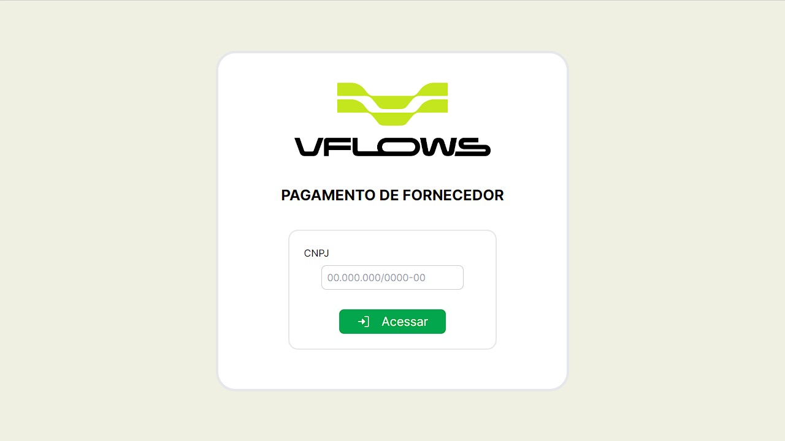
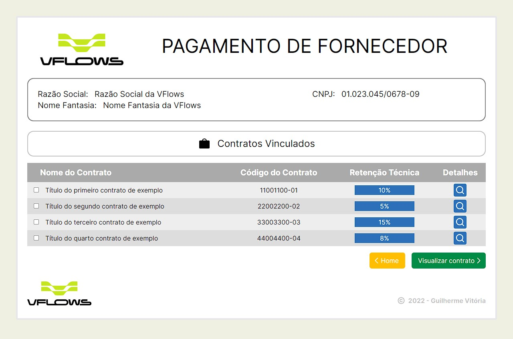
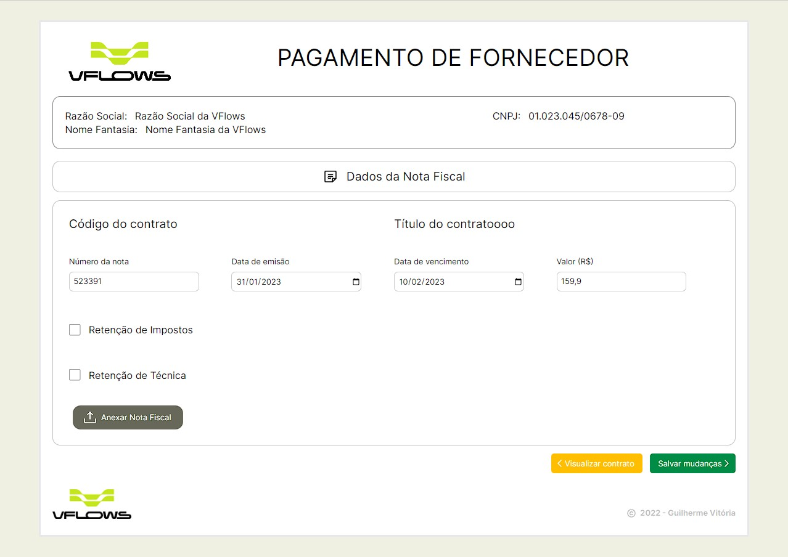
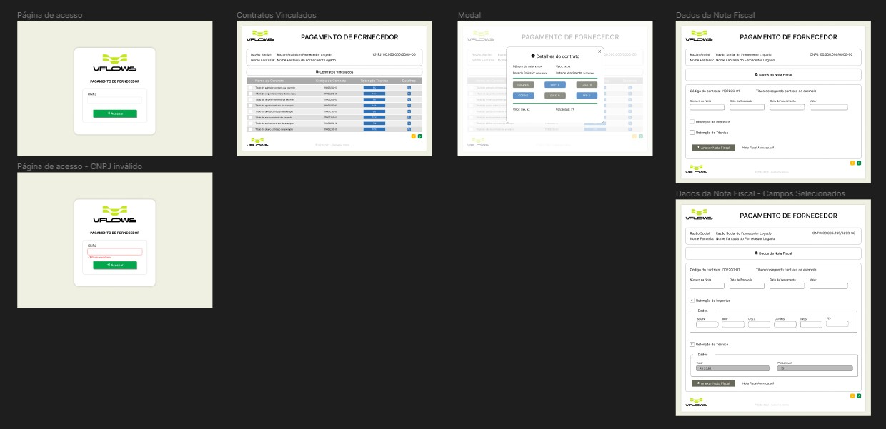
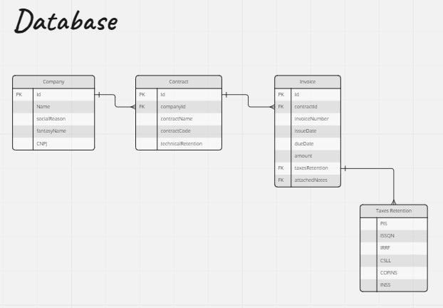

# Prosel VFlows

  

## Um pouco do Projeto:
---
➡ Desafio para avaliar conhecimentos técnicos, como lida com os requisitos e capacidade de pensar em soluções

➡ Construção do FrontEnd de uma aplicação de gerenciamento de pagamento de contratos

---
## Conteúdos

- [Overview](#overview)
  - [Requisitos](#requisitos)
  - [Como rodar o projeto](#como-rodar-o-projeto)
  - [Como utilizar](#como-utilizar-o-projeto)
  - [Screenshot e Páginas](#screenshot-paginas)
- [Processo](#processo)
  - [Pre Desenvolvimento](#pre-desenvolvimento)
  - [Tecnologia utilizadas](#tecnologias-utilizadas)
  - [O que eu aprendi](#oque-eu-aprendi)
- [Autor](#autor)

## Overview

### Requisitos
---
A Aplicação deve ser construídas utilizando as seguintes tecnologias:
   - NodeJS na versão 16.x ou superior
   - Linguagem: JavaScript
   - Lib: ReactJS
   - Estilos: TailwindCSS
   - Configuração de Rotas: React Router Dom
   - Estado compartilhado entre componentes: ContextAPI
   - Os formulários devem ser construídos utilizando: Unform

### Como rodar o projeto
---
   1. Clone o projeto com `git clone https://github.com/glsvitoria/prosel_vflows`
   2. Após clonar o projeto, basta apenas abrir a pasta do projeto e rodar `npm run dev`

### Como utilizar
---
   1. Digite o CNPJ de sua empresa
      - Caso ele esteja no banco de dados e possua um contrato ativo, será redirecionado para a página de contratos
      - Caso não esteja no banco de dados ou não tenha um contrato ativo, aparecerá a mensagem ao erro correspondente
   2. Clique na lupa referente ao contrato que deseja visualizar os detalhes e um modal será aberto mostrando as informações
   3. Desejando modificar alguma informação do contrato, selecione seu checkbox e clique em `visualizar contrato`
   4. Nessa página, é possível modificar as informações do contrato que você deseja e anexar uma nota fiscal. Ao final, clique em `salvar alterações`
      - Caso tudo esteja correto, será enviado todas as informações e você será redirecionado para a página inicial
      - Caso não, irá aparecer uma mensagem de “erro” no campo que estiver com algum problema

### Screenshot e Páginas
---
Home Page - Página de acesso

Contracts Page - Página de contratos vinculados

Invoice Page - Página de dados da nota fiscal

## Processo

### Pre Desenvolvimento
---
   - Layout criado no figma para as páginas web [FIGMA](https://www.figma.com/file/JkqBEKycqcIpi6iy4OfsKx/Prosel-VFlows?node-id=0%3A1&t=rPtY5COGQ8Cq5eUl-1)
   
   - Organização dos dados que serão criados e utilizados na aplicação [MIRO](https://miro.com/app/board/uXjVPqWx530=/?share_link_id=968923035230)
   

### Principais Tecnologias:
---

### Outras Tecnologias utilizadas:
---
   - Estilização e Responsividade: [TailwindCSS](https://tailwindcss.com)
   - Criação e validação de formulários: [Unform](https://unform-rocketseat.vercel.app) e [Yup](https://unform-rocketseat.vercel.app/guides/validation)
   - FakeAPI para criação de dados: [MirageJS](https://miragejs.com)
   - Requisições HTTP: [Axios](https://axios-http.com/ptbr/)
   - Ícones: [Phosphor-React](https://phosphoricons.com)
   - Navegação entre páginas: [React-Router-Dom](https://reactrouter.com/en/main)
   - Modal: [React-Modal](https://www.npmjs.com/package/react-modal)

### O que eu aprendi e implementei
---
   - Utilização do MirageJS e suas requisições criadas para pegar as informações do database
   - Criação de validação de formulário com Yup atrelado ao Unform
   - Aplicação da biblioteca React Modal com opções de responsividade
   - Planejamento de um projeto iniciando desde o Figma e Miro para o design e ideia para o database para após isso ir para o código

## Autor
---
- Linkedin - [Guilherme Vitória](https://www.linkedin.com/in/glsvitoria/)
- GitHub - [glsvitoria](https://github.com/glsvitoria)
- Instagram - [glsvitoria](https://www.instagram.com/glsvitoria/)
